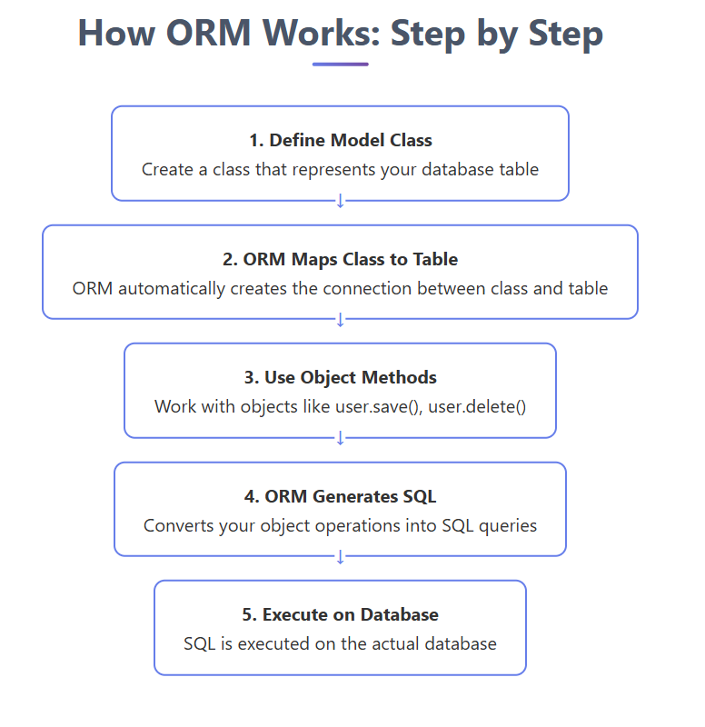

Prisma is an Open Source next generation ORM.
What is ORM?
ORM is a programming technique that lets you query and manipulate data from a database using object-oriented paradigm.

Prisma Client
Prisma Migration
Prisma Studio